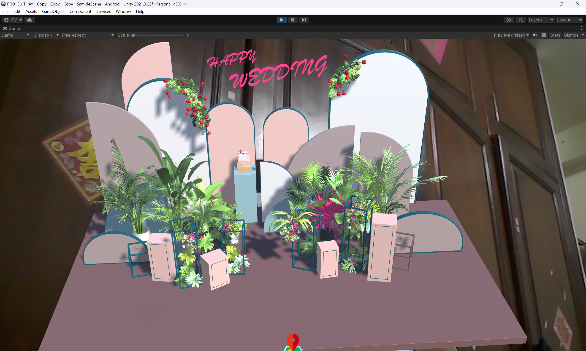

# AR Wedding Invitation

Welcome to the AR Wedding Invitation project! This project showcases an innovative and interactive way to deliver wedding details using augmented reality technology. Guests can experience the joy of our special day through their devices, witnessing virtual elements that breathe life into our love story and event information. This guide will walk you through the process of setting up and running the AR Wedding Invitation application.

  

## Video Preview

Get a glimpse of the AR Wedding Invitation experience by watching the video below:

  

  <em>Click the image above to watch the video.</em>

## Table of Contents

- [Getting Started](#getting-started)
  - [Prerequisites](#prerequisites)
  - [Installation](#installation)
  - [Usage](#usage)
- [Advanced Steps](#advanced-steps)
  - [Extracting Model Files](#extracting-model-files)
  - [Configuring Vuforia](#configuring-vuforia)
  - [Updating Targets](#updating-targets)
- [Troubleshooting](#troubleshooting)
- [Contributing](#contributing)
- [License](#license)

## Getting Started

### Prerequisites

Before you begin, ensure you have the following:

- [Unity](https://unity.com/) installed on your machine.
- A compatible device for AR testing, such as a smartphone or tablet.

### Installation

1. Clone this repository to your local machine using the following command:
git clone https://github.com/YourUsername/AR-Wedding-Invitation-Project.git

2. Open UnityHub and add the project by selecting the folder where you cloned the repository.

### Usage

1. Launch Unity and open the AR Wedding Invitation project.
2. Navigate to the appropriate scene for the AR experience.
3. Set up your AR device or emulator for testing.
4. Build and run the project to enjoy the immersive AR Wedding Invitation.

## Advanced Steps

### Extracting Model Files

1. Locate the `Assets\Model\` directory within the project.
2. Extract the contents of `Stage (1).rar` and move the extracted files to `Assets\Model\`.

Repeat this process for the `Assets\Stage\` directory using the `Stage_F1inal.rar` file.

### Configuring Vuforia

If the Vuforia target has expired, follow these steps:

1. Visit the [Vuforia Developer Portal](https://developer.vuforia.com/).
2. Create a new target image or object.
3. Download the target database and import it into your Unity project.

### Updating Targets

If the AR Wedding Invitation targets have changed or expired, you can update them by:

1. Opening the Vuforia configuration within Unity.
2. Replacing the old target images or objects with the new ones.

## Troubleshooting

If you encounter issues during setup or usage, please consult the [Troubleshooting Guide](TROUBLESHOOTING.md) for common solutions.

## Contributing

Contributions to the AR Wedding Invitation project are welcome! To contribute, follow these steps:
1. Fork this repository.
2. Create a new branch for your feature or bug fix.
3. Make your changes and commit them.
4. Submit a pull request to the main repository.

## License

This project is licensed under the [MIT License](LICENSE).
